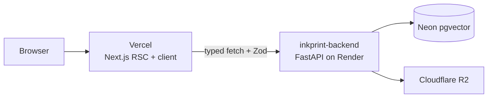

<!-- TODO: record a 10-second demo gif (paste text → certificate page) and drop it at assets/demo.gif -->

<h1 align="center">inkprint-frontend</h1>
<p align="center">
  <em>Content provenance certificate viewer — the visual layer for inkprint</em>
</p>

<p align="center">
  <a href="https://inkprint-frontend.vercel.app">Live Demo</a> •
  <a href="WHY.md">Why</a> •
  <a href="docs/ARCHITECTURE.md">Architecture</a> •
  <a href="docs/DEMO.md">Demo Script</a>
</p>

<p align="center">
  
  
</p>

---

## What it does

Paste any piece of text, click **Fingerprint**, and receive a cryptographically
signed "Certificate of Authorship" — serif headline, QR code, scannable
manifest, the whole thing. Every certificate issued by
[inkprint-backend](https://github.com/Abdul-Muizz1310/inkprint-backend) is
bound to an Ed25519 signature, a SHA-256 content hash, a SimHash, and a
768-dimensional semantic embedding. Later, you can verify any certificate
offline, compare a new piece of text against it for derivative-work detection,
or scan public corpora (Common Crawl, HuggingFace datasets) to see if the
original leaked into an AI training set.

## The unique angle

- **The certificate is the payoff.** `/certificates/[id]` is a React Server
  Component that fetches + parses on the server and hands a typed object to a
  pure presentational `CertificateCard`. No loading flicker on the one page
  where the visual has to land instantly.
- **Zod at every boundary.** Every response from the backend is parsed through
  a Zod schema before it reaches React. Schema drift fails loud at the edge —
  caught a real 64-bit simhash bug during the first live E2E, not as a
  mysterious `undefined` later.
- **Live-backend E2E.** The Playwright happy path runs against the *real*
  production backend. No mocks. That's how CORS and schema drift get caught
  for free.
- **Red-first Spec-TDD.** Every feature had a failing test before a line of
  implementation existed. See [tests/lib/](tests/lib/) and
  [tests/components/](tests/components/) — 80 unit tests landed before the
  first component was written.

## Quick start

```bash
git clone https://github.com/Abdul-Muizz1310/inkprint-frontend.git
cd inkprint-frontend
cp .env.example .env.local
pnpm install
pnpm dev
```

Then open http://localhost:3000.

The `.env.example` defaults point at the public backend at
`inkprint-backend.onrender.com`, so you don't need a local backend to develop
the frontend.

## Tech stack

| Concern | Choice |
|---|---|
| Framework | Next.js 16 App Router, React 19, React Compiler |
| Styling | Tailwind CSS v4, shadcn (base-nova), CSS custom properties |
| State | Zustand + TanStack Query where interactivity is dense |
| Forms / validation | Zod (`@/lib/schemas`, `@/lib/env`) |
| Diff view | `react-diff-viewer-continued` |
| QR codes | `qrcode.react` (client-side) + backend `/qr` (server-rendered PNG) |
| Icons | `lucide-react` |
| Unit tests | Vitest + Testing Library + jsdom |
| E2E tests | Playwright (chromium) against the live backend |
| Lint / format | Biome |
| Deploy | Vercel (auto-deploy on push to `main`) |

## Architecture

See [docs/ARCHITECTURE.md](docs/ARCHITECTURE.md) for the full diagram and
layering notes.



## Routes

| Route | Kind | Purpose |
|---|---|---|
| `/` | client island in RSC shell | Editor — paste text, author, fingerprint |
| `/certificates/[id]` | **RSC** | Styled certificate view — the emotional payoff |
| `/verify` | client | Paste a manifest, get a green/red itemised verdict |
| `/compare` | client | Diff new text against a parent certificate, get a derivative verdict |
| `/leak/[id]` | RSC shell + client terminal | Streaming leak-scan terminal (SSE) |

## Deployment

- **Frontend** — [https://inkprint-frontend.vercel.app](https://inkprint-frontend.vercel.app), auto-deployed from `main` via Vercel's GitHub integration.
- **Backend** — [https://inkprint-backend.onrender.com](https://inkprint-backend.onrender.com) on Render's free tier (always-warm). Owns Postgres (Neon pgvector) and Cloudflare R2.
- **Signing key** — Ed25519 keypair; private key in Render env, public key served from `/public-key.pem` so clients can verify offline.

Rollback is a Vercel dashboard click.

## Development

```bash
pnpm dev            # http://localhost:3000
pnpm lint           # biome
pnpm format         # biome --write
pnpm typecheck      # tsc --noEmit
pnpm test           # vitest (watch)
pnpm test --run     # vitest (CI mode)
pnpm test:e2e       # playwright against the live backend
pnpm build          # next build
```

CI (`.github/workflows/ci.yml`) runs lint → typecheck → vitest → next build on
every push to `main` and every PR. E2E is deferred to local pre-merge runs.

## Legal disclaimer

**Not legal advice.** inkprint issues cryptographic provenance records. Its
certificates may support first-authorship claims under the Berne Convention's
fixation principle and may help satisfy the EU AI Act's Article 50 detectability
requirements. The tool assists, it does not arbitrate — consult a qualified
attorney for any formal use.

## License

[BUSL-1.1](LICENSE) — converts to Apache-2.0 on 2030-04-08.
