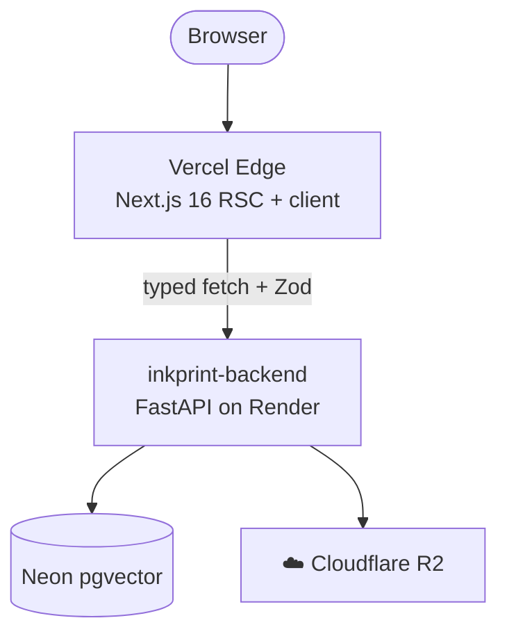
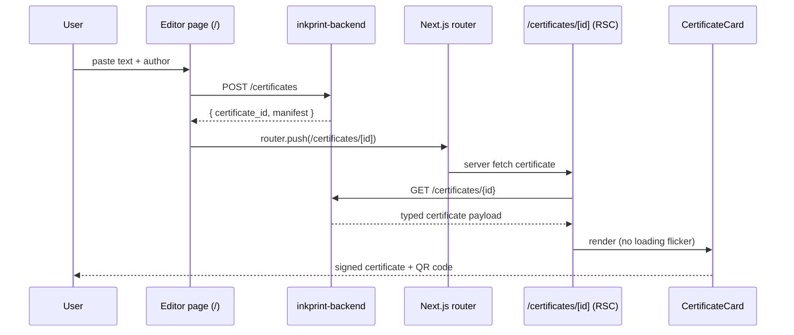
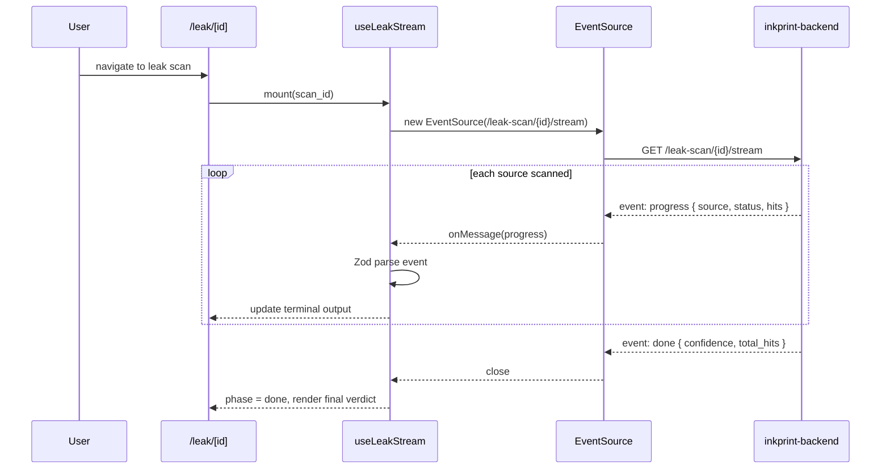

# 🖼️ `inkprint-frontend`

> ⚡ **Next.js 16 UI for cryptographic content provenance.**
> Paste text. Get a certificate. Verify authorship. Detect training-data leaks.

🌐 [Live App](https://inkprint-frontend.vercel.app) · 🔙 [Backend API](https://inkprint-backend.onrender.com/health) · 🔙 [Backend Repo](https://github.com/Abdul-Muizz1310/inkprint-backend) · 🚀 [Quickstart](#-run-locally) · 🏗️ [Architecture](#️-architecture) · 🧪 [Testing](#-testing)


---

```console
$ pnpm dev
  ▲ Next.js 16.0.0 (Turbopack)
  - Local:   http://localhost:3000
  - API:     https://inkprint-backend.onrender.com

[editor]       paste text + author → click Fingerprint
[certificate]  RSC fetch → CertificateCard renders instantly (no loading flicker)
[verify]       paste manifest → green/red itemised verdict
[compare]      diff new text against parent certificate → derivative score
[leak]         SSE terminal streaming Common Crawl ‖ HuggingFace ‖ The Stack v2
```

---

## 🎯 Why this exists

**The certificate is the payoff.** Users paste their text, get a cryptographically signed provenance certificate, and can immediately verify it, compare derivatives, or scan for training-data leaks — all in one interface.

- 🖼️ **The certificate page is a React Server Component.** `/certificates/[id]` fetches + parses on the server and hands a typed object to a pure presentational `CertificateCard`. No loading flicker on the one page where the visual has to land instantly.
- 🛡️ **Zod at every boundary.** Every response from the backend is parsed through a Zod schema before it reaches React. Schema drift fails loud at the edge — caught a real 64-bit simhash overflow bug during the first live E2E, not as a mysterious `undefined` later.
- 🎯 **Live-backend E2E.** The Playwright happy path runs against the *real* production backend. No mocks. That's how CORS and schema drift get caught for free.
- 🧪 **Red-first Spec-TDD.** Every feature had a failing test before a line of implementation existed — 80+ unit tests landed before the first component was written.

---

## ✨ Features

- 🖋️ Rich text editor with author field and one-click fingerprinting
- 📜 Server-rendered certificate page (RSC) — instant visual payoff
- ✅ Tamper verification with itemised green/red verdict breakdown
- 📊 Side-by-side diff view for derivative-work comparison
- 🔍 Live SSE-streaming leak-scan terminal (Common Crawl, HuggingFace, The Stack v2)
- 🛡️ Zod validation at every external boundary (API, env, SSE events)
- 📱 QR code display linking to the certificate permalink
- ⚛️ React 19 + React Compiler enabled
- 🖥️ Terminal-style UI chrome (shadcn base-nova)
- 💤 Backend health indicator with cold-start detection

---

## 🏗️ Architecture



### 📜 Certificate happy path



### 🔍 Leak scan SSE flow



**Zod at every boundary:**
- 🌱 `env.ts` — validates `NEXT_PUBLIC_*` at import time
- 🌐 `api.ts` — schema-parses every fetch response
- 📡 `sse.ts` — validates every SSE event payload

---

## 🗂️ Project structure

```
src/
├── app/
│   ├── page.tsx                      # Home: text editor + fingerprint button
│   ├── layout.tsx                    # Root layout + metadata
│   ├── providers.tsx                 # TanStack Query provider
│   ├── certificates/[id]/
│   │   ├── page.tsx                  # RSC — server-fetched certificate view
│   │   ├── error.tsx                 # Error boundary
│   │   └── not-found.tsx             # 404 fallback
│   ├── verify/
│   │   └── page.tsx                  # Paste manifest, get itemised verdict
│   ├── compare/
│   │   └── page.tsx                  # Diff new text against parent certificate
│   └── leak/[id]/
│       └── page.tsx                  # SSE streaming leak-scan terminal
├── components/
│   ├── certificate-card.tsx          # Styled certificate display (pure)
│   ├── editor.tsx                    # Text input + author + fingerprint action
│   ├── verdict-badge.tsx             # Green/red tamper verdict
│   ├── diff-view.tsx                 # Side-by-side diff (react-diff-viewer)
│   ├── leak-terminal.tsx             # Streaming SSE terminal output
│   ├── qr-display.tsx               # QR code render
│   ├── backend-status.tsx            # Cold / warm / down indicator
│   ├── legal-disclaimer.tsx          # Legal notice component
│   ├── terminal/                     # Terminal window, nav, prompt, status bar
│   └── ui/                           # shadcn primitives (base-nova)
└── lib/
    ├── env.ts                        # Runtime env validation (Zod)
    ├── api.ts                        # TanStack Query hooks + typed fetch
    ├── sse.ts                        # SSE EventSource hook with Zod validation
    ├── schemas.ts                    # Zod schemas for all API contracts
    ├── format.ts                     # Formatting utilities
    └── utils.ts                      # cn() (clsx + tailwind-merge)
```

> 📐 **Rule:** `app/` routes are thin RSC shells. Components are pure and dumb. All side effects live in `lib/`.

---

## 🗺️ Routes

| Route | Kind | Purpose |
|---|---|---|
| `/` | Client island in RSC shell | Editor — paste text + author, click Fingerprint |
| `/certificates/[id]` | **RSC** | Styled certificate view — the emotional payoff (no loading flicker) |
| `/verify` | Client | Paste a manifest, get a green/red itemised verdict |
| `/compare` | Client | Diff new text against a parent certificate, get a derivative verdict |
| `/leak/[id]` | RSC shell + client terminal | Streaming leak-scan terminal (SSE from backend) |

---

## 🛠️ Stack

| Concern | Choice |
|---|---|
| **Framework** | Next.js 16 (App Router, React Server Components, React Compiler) |
| **UI** | React 19 · TypeScript strict |
| **Styling** | Tailwind CSS v4 · shadcn/ui (base-nova) · lucide-react |
| **State** | Zustand + TanStack Query v5 |
| **Validation** | Zod (env, API, SSE — every external boundary) |
| **Diff** | react-diff-viewer-continued |
| **QR** | qrcode.react (client) + backend `/qr` (server-rendered PNG) |
| **Testing** | Vitest + Testing Library (unit, 80+ tests) · Playwright (e2e, live backend) |
| **Lint / Format** | Biome (replaces ESLint + Prettier) |
| **Hosting** | Vercel (auto-deploy on push to `main`) |

---

## 🚀 Run locally

```bash
# 1. clone & install
git clone https://github.com/Abdul-Muizz1310/inkprint-frontend.git
cd inkprint-frontend
pnpm install

# 2. env
cp .env.example .env.local
# defaults point at public backend — no local backend needed

# 3. dev
pnpm dev
# → http://localhost:3000
```

### 🌱 Environment

| Var | Purpose |
|---|---|
| `NEXT_PUBLIC_API_URL` | inkprint-backend base URL (REST + SSE) |
| `NEXT_PUBLIC_SITE_URL` | Public canonical URL (OG tags, absolute links) |

Validated at import time in [`src/lib/env.ts`](src/lib/env.ts) via Zod. Missing vars crash boot — **parse, don't validate**.

### 📜 Scripts

```bash
pnpm dev          # Next.js dev server (Turbopack)
pnpm build        # production build
pnpm start        # production server
pnpm lint         # Biome check
pnpm format       # Biome write
pnpm typecheck    # tsc --noEmit
pnpm test         # Vitest (watch)
pnpm test --run   # Vitest (CI mode)
pnpm test:e2e     # Playwright against live backend
```

---

## 🧪 Testing

```bash
pnpm test                    # watch
pnpm test -- --run           # CI
pnpm test -- --coverage      # coverage report
pnpm test:e2e                # Playwright chromium (live backend)
```

| Metric | Value |
|---|---|
| **Unit tests** | 80+ tests across components + lib (Vitest + jsdom) |
| **E2E** | Playwright chromium against live production backend |
| **Methodology** | Red-first Spec-TDD — every test written before implementation |
| **Zod coverage** | Discriminated unions at env, API, SSE boundaries |

CI (`.github/workflows/ci.yml`) runs lint → typecheck → vitest → next build on every push to `main` and every PR.

---

## 📐 Engineering philosophy

| Principle | How it shows up |
|---|---|
| 🧪 **Spec-TDD** | 80+ unit tests landed before the first component was written. Failing test before every feature. |
| 🛡️ **Negative-space programming** | Zod discriminated unions reject malformed payloads at every boundary. RSC error/not-found boundaries catch invalid certificate IDs. |
| 🧬 **Parse, don't validate** | Zod at every edge: env, REST, SSE. No `any`, no unsafe casts, no optional-chain bug masks. |
| 🏗️ **Separation of concerns** | `app/` thin RSC shells · `components/` pure + dumb · `lib/` owns side effects. |
| 🔤 **Typed everything** | TS strict; Zod-inferred types flow end-to-end; no untyped dicts across module boundaries. |
| 🌊 **Pure core, imperative shell** | `CertificateCard`, `VerdictBadge`, schemas = pure. SSE + Query + fetch = imperative shell, isolated in `lib/`. |

---

## 🚀 Deploy

Hosted on **Vercel**. Push to `main` → Vercel build → preview URL → promote to prod.

Required env vars at build time:

- `NEXT_PUBLIC_API_URL`
- `NEXT_PUBLIC_SITE_URL`

Next config: `reactCompiler: true`.

Rollback is a Vercel dashboard click.

---

## ⚖️ Legal disclaimer

**Not legal advice.** inkprint issues cryptographic provenance records. Its certificates may support first-authorship claims under the Berne Convention's fixation principle and may help satisfy the EU AI Act's Article 50 detectability requirements. The tool assists, it does not arbitrate — consult a qualified attorney for any formal use.

---

## 📄 License

[BUSL-1.1](LICENSE) — converts to Apache-2.0 on 2030-04-08. Licensor: Abdul-Muizz Anwar.

---

> 🖋️ **`inkprint --help`** · sign it, fingerprint it, prove it's yours
