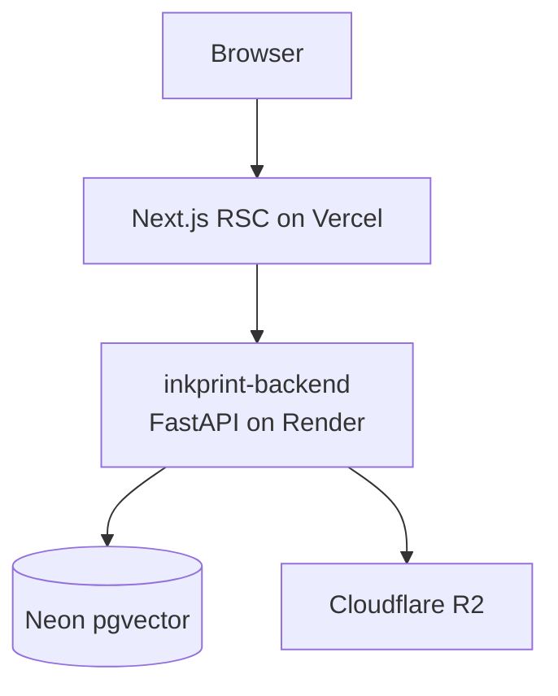

# Architecture

> Placeholder — finalized in S6.

## Overview

The inkprint frontend is a Next.js 16 App Router application deployed to Vercel. It talks to the FastAPI backend at `NEXT_PUBLIC_API_URL` for all data.

## Layers

- `src/app/` — routes (RSC by default, `"use client"` only where interactivity is needed)
- `src/components/` — presentational + interactive components
- `src/components/ui/` — shadcn primitives (not touched by lint)
- `src/lib/` — env validation, API client, schemas, utilities
- `src/hooks/` — reusable React hooks

<!-- TODO: expand in S6 with real diagram + data-flow notes -->
