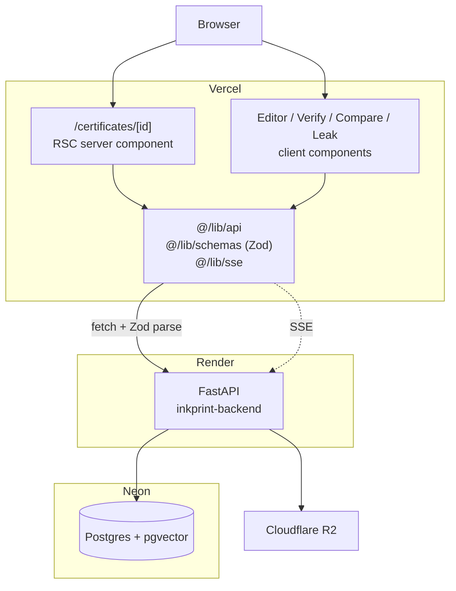
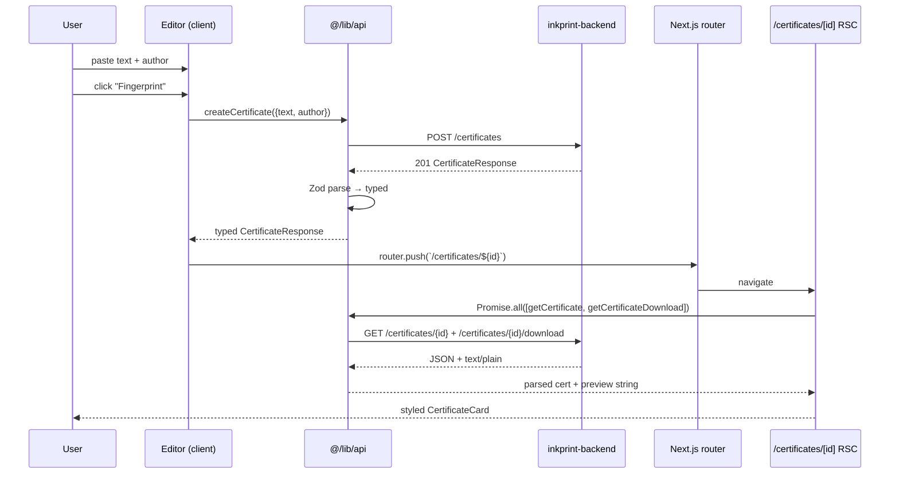

# Architecture

## Overview

`inkprint-frontend` is a Next.js 16 App Router application deployed to Vercel.
It has no database of its own — every call crosses a typed boundary to the
[inkprint-backend](https://github.com/Abdul-Muizz1310/inkprint-backend) FastAPI
service on Render, which owns Postgres (Neon pgvector), R2 blob storage, and
Ed25519 signing.



## Layering

The codebase follows a strict layered structure. Nothing reaches across layers;
a component never touches `fetch`, and the API module never knows what a React
component is.

```
src/
├── app/            # routes (RSC by default; "use client" only where needed)
│   ├── page.tsx                       # / — landing + editor
│   ├── certificates/[id]/
│   │   ├── page.tsx                   # RSC — parallel fetch cert + first 200 chars
│   │   ├── not-found.tsx              # 404 surface
│   │   └── error.tsx                  # 5xx surface with reset()
│   ├── verify/page.tsx                # client — manifest paste + check
│   ├── compare/page.tsx               # client — parent id + new text → diff
│   └── leak/[id]/page.tsx             # RSC UUID gate → mounts <LeakTerminal/>
│
├── components/     # presentational + interactive components
│   ├── certificate-card.tsx           # the emotional payoff
│   ├── editor.tsx                     # textarea + author + submit
│   ├── diff-view.tsx                  # react-diff-viewer-continued wrapper
│   ├── leak-terminal.tsx              # owns the SSE connection
│   ├── qr-display.tsx                 # QR via qrcode.react OR  from backend
│   ├── verdict-badge.tsx              # 5 diff verdicts, colour-coded
│   └── legal-disclaimer.tsx           # "Not legal advice" note
│
└── lib/            # shared, pure, no-React
    ├── env.ts                         # Zod-validated NEXT_PUBLIC_* (fails loud at import time)
    ├── schemas.ts                     # Zod mirrors of every backend response + LeakEvent union
    ├── api.ts                         # typed fetch client; ApiError for every failure
    ├── sse.ts                         # typed EventSource wrapper for leak-scan stream
    ├── format.ts                      # pure formatters (truncateMiddle, formatIssuedAt, formatKeyId)
    └── utils.ts                       # cn() classname helper
```

## Data flow — the fingerprint happy path



## Why RSC for `/certificates/[id]`

The certificate page is the only page where visual impact matters more than
interactivity. A fetch-on-client + loading-flicker pattern would undercut the
payoff. RSC pre-fetches both endpoints in parallel on the server, so the page
arrives fully-rendered during the router transition. The only interactive parts
of the card — copy-hash, share, download-manifest — are isolated inside
`CertificateCard` as a client island.

## Why Zod at every API boundary

The backend is a separate service with its own versioning; a field rename or
type change there should not cascade silently through the frontend. Every
response goes through a Zod schema in [src/lib/schemas.ts](../src/lib/schemas.ts).
A concrete payoff: the backend emits 64-bit unsigned integers for the
`simhash` field, which exceeds `Number.MAX_SAFE_INTEGER`. Zod v4's `.int()`
rejected it, which broke fingerprinting on the very first live request — but
it broke *loudly* at the Zod parse, not as a mysterious `undefined` three layers
deep. Fix was one-line.

## Testing boundary

- **Unit/integration (`tests/lib/**`, `tests/components/**`)** — mocked `fetch`,
  mocked `EventSource`, mocked `next/navigation`. Runs in jsdom via vitest. Red
  before green per Spec-TDD.
- **E2E (`tests/e2e/cert-flow.spec.ts`)** — Playwright against the **live**
  backend. No mocks. Catches CORS regressions, schema drift, and real cold-start
  behaviour for free. Deferred from CI for now because the Render free tier
  cold-start takes 20–30s on the first POST of a session; local pre-merge runs
  are the gate.

## Deployment topology

```
GitHub (Abdul-Muizz1310/inkprint-frontend @ main)
  │
  │ push
  ▼
Vercel build (pnpm install → lint → typecheck → vitest → next build)
  │
  ▼
https://inkprint-frontend.vercel.app
  │
  │ browser fetch (CORS-allowed)
  ▼
https://inkprint-backend.onrender.com
  │
  ├─▶ Neon Postgres (pgvector branch `inkprint`)
  └─▶ Cloudflare R2 (certificate archive)
```

The frontend is stateless. Rollbacks are a Vercel dashboard click; promotions
happen on every merge to `main`.
