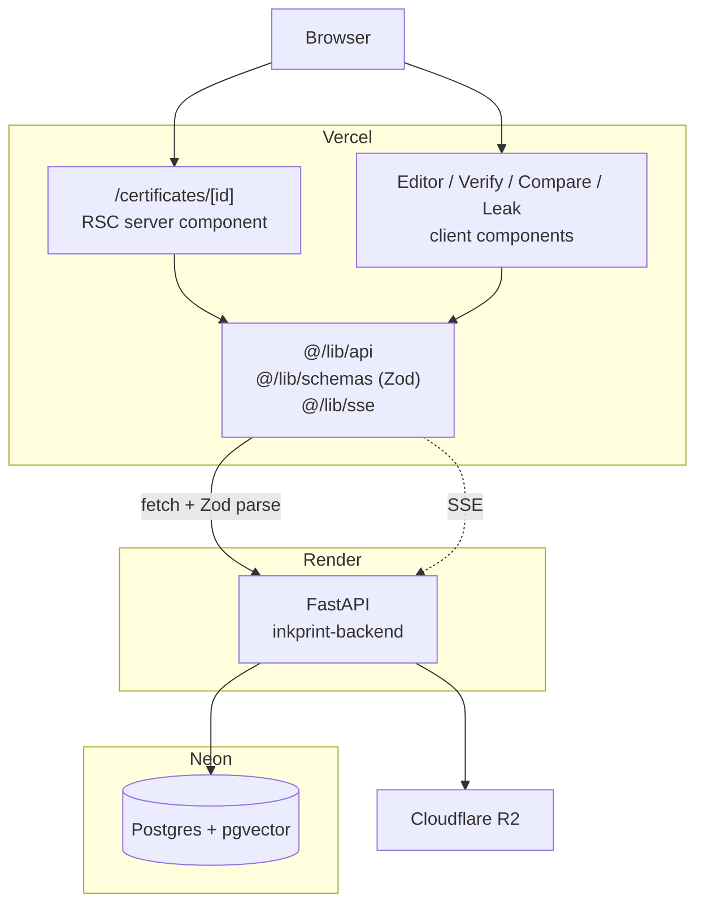
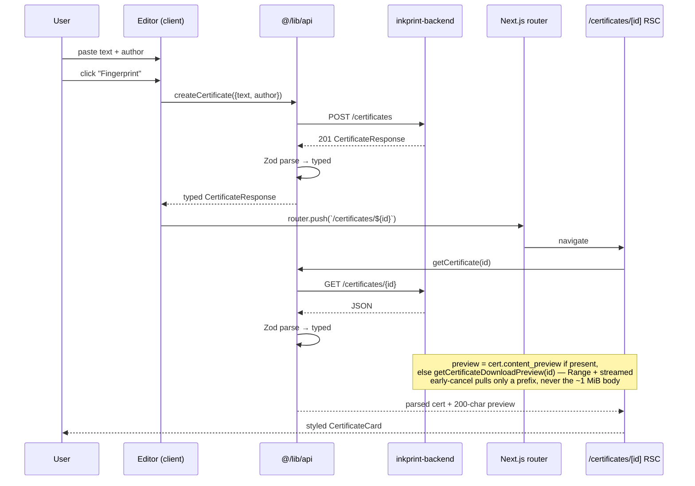

# Architecture

## Overview

`inkprint-frontend` is a Next.js 16 App Router application deployed to Vercel.
It has no database of its own — every call crosses a typed boundary to the
[inkprint-backend](https://github.com/Abdul-Muizz1310/inkprint-backend) FastAPI
service on Render, which owns Postgres (Neon pgvector), R2 blob storage, and
Ed25519 signing.


```mermaid
graph TD
  Browser[Browser]
  subgraph Vercel
    RSC["/certificates/[id]<br/>RSC server component"]
    Client["Editor / Verify / Compare / Leak<br/>client components"]
    Lib["@/lib/api<br/>@/lib/schemas (Zod)<br/>@/lib/sse"]
  end
  subgraph Render
    API[FastAPI<br/>inkprint-backend]
  end
  subgraph Neon
    DB[(Postgres + pgvector)]
  end
  R2[Cloudflare R2]

  Browser --> RSC
  Browser --> Client
  RSC --> Lib
  Client --> Lib
  Lib -->|fetch + Zod parse| API
  Lib -.SSE.-> API
  API --> DB
  API --> R2
```

## Layering

The codebase follows a strict layered structure. Nothing reaches across layers;
a component never touches `fetch`, and the API module never knows what a React
component is.

```
src/
├── app/            # routes (RSC by default; "use client" only where needed)
│   ├── page.tsx                       # / — landing + editor
│   ├── certificates/[id]/
│   │   ├── page.tsx                   # RSC — fetch cert; derive 200-char preview (from content_preview, else download)
│   │   ├── not-found.tsx              # 404 surface
│   │   └── error.tsx                  # 5xx surface with reset()
│   ├── verify/page.tsx                # client — manifest paste + check
│   ├── compare/page.tsx               # client — parent id + new text → diff
│   └── leak/[id]/page.tsx             # RSC UUID gate → mounts <LeakTerminal/>
│
├── components/     # presentational + interactive components
│   ├── certificate-card.tsx           # the emotional payoff
│   ├── editor.tsx                     # textarea + author + submit
│   ├── diff-view.tsx                  # react-diff-viewer-continued wrapper
│   ├── leak-terminal.tsx              # owns the SSE connection
│   ├── qr-display.tsx                 # QR via qrcode.react (client-rendered SVG, single source of truth)
│   ├── verdict-badge.tsx              # 5 diff verdicts, colour-coded
│   └── legal-disclaimer.tsx           # "Not legal advice" note
│
└── lib/            # shared, pure, no-React
    ├── env.ts                         # Zod-validated NEXT_PUBLIC_* (fails loud at import time)
    ├── schemas.ts                     # Zod mirrors of every backend response (incl. manifest + leak result) + LeakEvent union
    ├── api.ts                         # typed fetch client; Zod-parses every response, 30s AbortSignal timeout, ApiError for every failure
    ├── ids.ts                         # shared UUID gate (isUuid) — the single validation choke-point for id-taking paths
    ├── sse.ts                         # typed EventSource wrapper for leak-scan stream
    ├── format.ts                      # pure formatters (truncateMiddle, formatIssuedAt, formatKeyId)
    └── utils.ts                       # cn() classname helper
```

## Data flow — the fingerprint happy path


```mermaid
sequenceDiagram
  participant U as User
  participant E as Editor (client)
  participant API as @/lib/api
  participant BE as inkprint-backend
  participant R as Next.js router
  participant RSC as /certificates/[id] RSC

  U->>E: paste text + author
  U->>E: click "Fingerprint"
  E->>API: createCertificate({text, author})
  API->>BE: POST /certificates
  BE-->>API: 201 CertificateResponse
  API->>API: Zod parse → typed
  API-->>E: typed CertificateResponse
  E->>R: router.push(`/certificates/${id}`)
  R->>RSC: navigate
  RSC->>API: getCertificate(id)
  API->>BE: GET /certificates/{id}
  BE-->>API: JSON
  API->>API: Zod parse → typed
  Note over RSC,BE: preview = cert.content_preview if present,<br/>else getCertificateDownloadPreview(id) — Range + streamed<br/>early-cancel pulls only a prefix, never the ~1 MiB body
  API-->>RSC: parsed cert + 200-char preview
  RSC-->>U: styled CertificateCard
```

## Why RSC for `/certificates/[id]`

The certificate page is the only page where visual impact matters more than
interactivity. A fetch-on-client + loading-flicker pattern would undercut the
payoff. RSC pre-fetches both endpoints in parallel on the server, so the page
arrives fully-rendered during the router transition. The only interactive parts
of the card — copy-hash, share, download-manifest — are isolated inside
`CertificateCard` as a client island.

Certificates are immutable once issued, so `getCertificate` /
`getCertificateDownload` are fetched with `next: { revalidate: 3600 }`. A
widely-shared or QR-linked certificate is therefore served as an ISR-cached
page instead of re-waking the cold-start-prone free-tier backend on every view.

The digest preview never pulls the full body (OPT-2). When the backend supplies
`content_preview` the RSC uses it directly; otherwise `getCertificateDownloadPreview`
requests a `Range: bytes=0-N` window and streams the response, cancelling the
reader as soon as it has `PREVIEW_CHARS` characters — so even a backend that
ignores `Range` and answers `200` with a ~1 MiB body has its transfer aborted
mid-stream. That fetch is intentionally `no-store` (Next's data cache would
buffer the whole response and defeat the early-cancel); the immutable *metadata*
fetch still carries the ISR cache.

## Why Zod at every API boundary

The backend is a separate service with its own versioning; a field rename or
type change there should not cascade silently through the frontend. Every
response goes through a Zod schema in [src/lib/schemas.ts](../src/lib/schemas.ts).
A concrete payoff: the backend emits 64-bit unsigned integers for the
`simhash` field, which exceeds `Number.MAX_SAFE_INTEGER`. Zod v4's `.int()`
rejected it, which broke fingerprinting on the very first live request — but
it broke *loudly* at the Zod parse, not as a mysterious `undefined` three layers
deep. Fix was one-line.

## Testing boundary

- **Unit/integration (`tests/lib/**`, `tests/components/**`, `tests/app/**`)** —
  mocked `fetch`, mocked `EventSource`, mocked `next/navigation`. Runs in jsdom
  via vitest. Red before green per Spec-TDD. The **route layer is covered here**:
  `tests/app/` drives the RSC compose logic (UUID gate → parallel fetch → 404 /
  error branching for `certificates/[id]` and `leak/[id]`) and the client pages'
  wiring (`verify` deep-link auto-load + UUID gate, `compare` UUID gate + diff),
  so the router→network layer no longer depends on a test that never runs in CI.
- **E2E (`tests/e2e/cert-flow.spec.ts`)** — Playwright against the **live**
  backend. No mocks. Catches CORS regressions, schema drift, and real cold-start
  behaviour for free. Still deferred from CI (the Render free tier cold-start
  takes 20–30s on the first POST of a session), but it is now a *supplementary*
  live smoke, not the only thing exercising `src/app/`.

## Deployment topology

```
GitHub (Abdul-Muizz1310/inkprint-frontend @ main)
  │
  │ push
  ▼
Vercel build (pnpm install → lint → typecheck → vitest → next build)
  │
  ▼
https://inkprint-frontend.vercel.app
  │
  │ browser fetch (CORS-allowed)
  ▼
https://inkprint-backend.onrender.com
  │
  ├─▶ Neon Postgres (pgvector branch `inkprint`)
  └─▶ Cloudflare R2 (certificate archive)
```

The frontend is stateless. Rollbacks are a Vercel dashboard click; promotions
happen on every merge to `main`.
